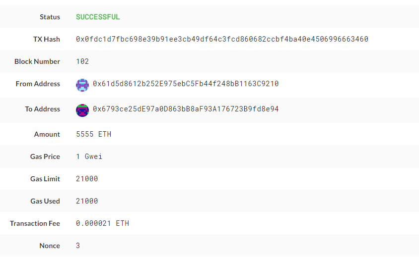
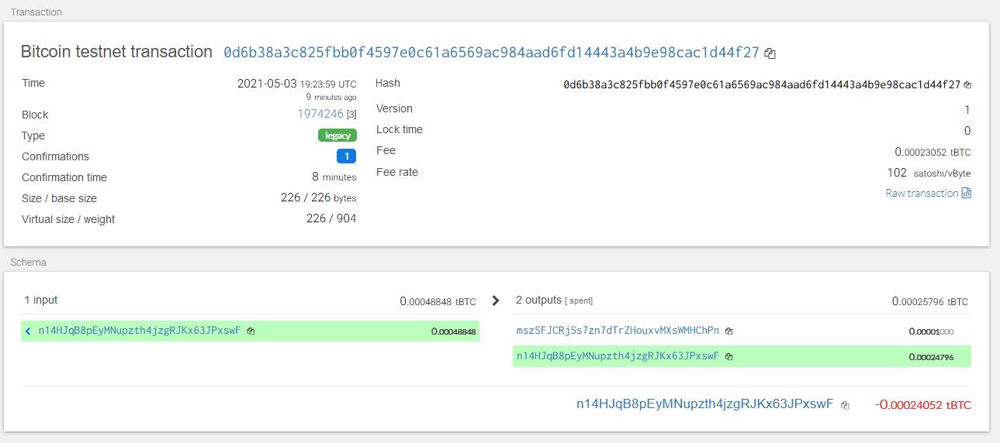

# HW19
HW19 - Multi-Blockchain Wallet in Python

*eth transaction*

account_obj = priv_key_to_account(ETH, coins[ETH][0]['privkey'])

sent = send_tx(ETH, account_obj, coins[ETH][1]['address'], 5555)

*btctest transaction*

account_obj = priv_key_to_account(BTCTEST, coins[BTCTEST][0]['privkey'])

sent = send_tx(BTCTEST, account_obj, coins[BTCTEST][1]['address'], 0.00001)

